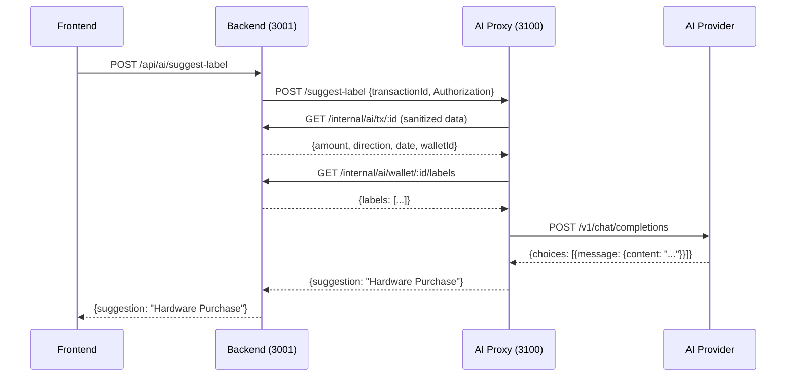

# AI Proxy Architecture

The AI proxy is a security-isolated Express service (port 3100) that performs all external AI calls on behalf of Sanctuary. It is the only component that contacts an AI provider — the backend never calls external AI directly. Its narrow access boundary (sanitized metadata only, no database, no keys) limits blast radius if the container is compromised.

---

## Request Flow



The proxy never stores state between requests. Configuration (`aiConfig`) is held in-process memory and updated via `POST /config`.

---

## Layer Architecture

| Layer                | Location                | Responsibility                                                                                                     |
| -------------------- | ----------------------- | ------------------------------------------------------------------------------------------------------------------ |
| Entry point & routes | `src/index.ts`          | Express app, all route handlers, global error/signal handlers                                                      |
| Request validation   | `src/requestSchemas.ts` | Zod schemas; `parseRequestBody()` returns `null` on failure and writes 400 before the handler continues            |
| Rate limiting        | `src/rateLimit.ts`      | In-memory sliding-window limiter keyed by client IP                                                                |
| AI client            | `src/aiClient.ts`       | `callExternalAI()`, `callExternalAIWithMessages()`, `parseStructuredResponse()`                                    |
| Backend data fetch   | `src/utils.ts`          | `fetchFromBackend()` with typed error discrimination (`auth_failed`, `not_found`, `server_error`, `network_error`) |
| Model management     | `src/modelPull.ts`      | Streams Ollama pull progress to backend via `POST /internal/ai/pull-progress`                                      |
| Constants            | `src/constants.ts`      | Timeout and rate-limit values, all overridable via env vars                                                        |
| Logger               | `src/logger.ts`         | Thin structured logger; no `console.log` in production code                                                        |

---

## Authentication

Three independent auth mechanisms apply in sequence:

1. **Service auth** — every route except `GET /health` requires `x-ai-service-secret` to match `AI_CONFIG_SECRET`. `POST /config` also accepts the configuration-specific `x-ai-config-secret` header, and backend callers send both headers. If the env var is absent, a cryptographically random 32-byte secret is generated at startup, making non-health routes unreachable until the secret is shared.

2. **Per-request bearer token** — Data-fetching endpoints that need user/wallet authorization (`/suggest-label`, `/query`) forward the caller's `Authorization: Bearer <token>` to the backend's `/internal/ai/*` endpoints. If the backend returns 401 or 403, the proxy propagates the auth failure immediately and does not call the AI provider.

3. **Provider credential boundary** — provider API keys are synced from backend encrypted settings into proxy memory only. They are never returned by `GET /config`, never stored by the proxy, and are forwarded to OpenAI-compatible providers only as an `Authorization: Bearer ...` header.

---

## API Endpoints

| Method   | Path             | Rate limited | Purpose                                                                |
| -------- | ---------------- | :----------: | ---------------------------------------------------------------------- |
| `GET`    | `/health`        |      —       | Liveness check                                                         |
| `GET`    | `/config`        |      —       | Current config status (enabled, model, endpoint presence)              |
| `POST`   | `/config`        |      —       | Update enabled/endpoint/model; requires `x-ai-config-secret`           |
| `POST`   | `/suggest-label` |     yes      | Label suggestion for a single transaction                              |
| `POST`   | `/query`         |     yes      | Natural-language to structured query object                            |
| `POST`   | `/analyze`       |     yes      | Treasury intelligence (UTXO health, fees, anomaly, tax, consolidation) |
| `POST`   | `/chat`          |     yes      | Multi-turn treasury advisor chat                                       |
| `POST`   | `/test`          |     yes      | Probe AI reachability                                                  |
| `POST`   | `/detect-ollama` |     yes      | Scan common Ollama endpoints, return first reachable                   |
| `POST`   | `/check-ollama`  |     yes      | Legacy route name; verifies the configured provider endpoint           |
| `GET`    | `/list-models`   |     yes      | List models from Ollama `/api/tags` or OpenAI-compatible `/v1/models`  |
| `POST`   | `/pull-model`    |     yes      | Start async Ollama model download; streams progress to backend         |
| `DELETE` | `/delete-model`  |     yes      | Remove a model from Ollama                                             |

---

## Validation

`parseRequestBody(schema, req, res, errorMessage)` in `requestSchemas.ts` wraps every route. It calls `schema.safeParse(req.body ?? {})` and returns `null` (writing a 400 with Zod issue details) when validation fails, so route handlers begin with:

```typescript
const body = parseRequestBody(
  SuggestLabelBodySchema,
  req,
  res,
  "transactionId required",
);
if (!body) return;
```

All schemas use `.strict()` to reject unknown fields. Key constraints:

- Strings: trimmed, bounded (`max(200)` for IDs, `max(1000)` for queries, `max(8000)` for chat messages)
- URLs: validated with `new URL()` — must be `http:` or `https:`
- Chat: 1–50 messages per request; roles restricted to `system | user | assistant`
- Analysis type: enum of `utxo_health | fee_timing | anomaly | tax | consolidation`

---

## Rate Limiting

In-memory sliding-window limiter (`src/rateLimit.ts`):

- Default: **10 requests per minute** per client IP
- Window and limit are configurable via env vars (see below)
- Expired entries are purged every 5 minutes
- Responds 429 with `{ error: "...", retryAfter: <seconds> }` on breach

Because the proxy runs as a single container, the store is not distributed. This is intentional — the proxy has exactly one instance.

---

## AI Provider Protocol

The proxy speaks the OpenAI chat completions wire format (`POST /v1/chat/completions`). Provider endpoints are auto-normalized:

- `http://host.docker.internal:11434` → `http://host.docker.internal:11434/v1/chat/completions`
- `http://host.docker.internal:11434/v1` → same
- `http://host.docker.internal:11434/v1/chat/completions` → unchanged
- `http://lmstudio.local:1234/v1` → `http://lmstudio.local:1234/v1/chat/completions`

This makes the proxy compatible with Ollama, LM Studio, llama.cpp with an OpenAI adapter, and OpenAI-compatible cloud providers without code changes.

**Timeouts**: standard requests abort at `AI_REQUEST_TIMEOUT_MS` (30 s default); treasury analysis uses `AI_ANALYSIS_TIMEOUT_MS` (120 s default) because complex prompts take longer.

---

## Configuration

| Variable                      | Default               | Description                                                                                                         |
| ----------------------------- | --------------------- | ------------------------------------------------------------------------------------------------------------------- |
| `PORT`                        | `3100`                | Listening port                                                                                                      |
| `BACKEND_URL`                 | `http://backend:3001` | Backend base URL for internal data fetches                                                                          |
| `AI_CONFIG_SECRET`            | _(random at startup)_ | Shared secret for `POST /config`; must match what the backend sends                                                 |
| `AI_PROXY_ALLOWED_HOSTS`      | _(empty)_             | Comma-separated host allowlist for public/cloud providers; supports exact hosts and `*.example.com` suffix patterns |
| `AI_PROXY_ALLOWED_CIDRS`      | _(empty)_             | Comma-separated IPv4 CIDRs for explicit provider endpoint allowlisting                                              |
| `AI_PROXY_ALLOW_PUBLIC_HTTPS` | `false`               | When `true`, any public HTTPS provider endpoint is allowed; public HTTP remains blocked unless host/CIDR-allowed    |
| `NODE_ENV`                    | `production`          | Node environment                                                                                                    |
| `AI_RATE_LIMIT_WINDOW_MS`     | `60000`               | Rate limit window in milliseconds                                                                                   |
| `AI_RATE_LIMIT_MAX_REQUESTS`  | `10`                  | Max requests per window per IP                                                                                      |
| `AI_REQUEST_TIMEOUT_MS`       | `30000`               | AI call timeout for standard requests                                                                               |
| `AI_ANALYSIS_TIMEOUT_MS`      | `120000`              | AI call timeout for treasury analysis requests                                                                      |

---

## Key Design Decisions

**Single-file routing.** All route handlers live in `src/index.ts`. The proxy is intentionally thin — adding a router hierarchy would add indirection without benefit at this scale.

**No database access.** The proxy fetches only what each request needs from `BACKEND_URL/internal/ai/*`. There is no persistent storage, no Prisma, no Redis. This is a deliberate security boundary: compromise of the AI container yields sanitized metadata only.

**In-process config.** `aiConfig` (enabled, endpoint, model) is held in memory and reset on container restart. The backend re-pushes config after each restart via `POST /config`. This avoids a shared config store and keeps the container stateless.

**Provider endpoint policy.** The proxy allows local/container/LAN LLM endpoints by default (`ollama`, `localhost`, `host.docker.internal`, `*.local`, loopback, RFC1918 private IPv4 ranges). Public/cloud endpoints require `AI_PROXY_ALLOWED_HOSTS`, `AI_PROXY_ALLOWED_CIDRS`, or `AI_PROXY_ALLOW_PUBLIC_HTTPS=true`. URLs with embedded credentials are rejected.

**Null-return error propagation.** `callExternalAI` and `callExternalAIWithMessages` return `null` on any failure (timeout, non-2xx, malformed response). Routes treat `null` as 503. This keeps error handling uniform and avoids exception bubbling through route logic.

**Async model pull.** `POST /pull-model` returns `{ success: true, status: "started" }` immediately, then fires `streamModelPull()` in the background. Progress is pushed to `BACKEND_URL/internal/ai/pull-progress` as newline-delimited JSON from the Ollama stream — the HTTP response channel is not kept open.
