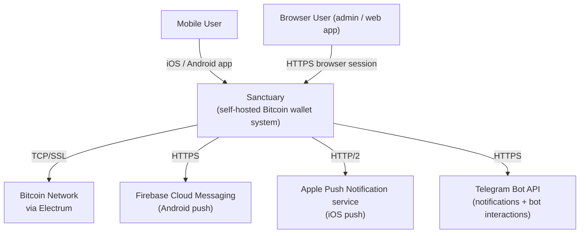

# Sanctuary Architecture

Living architecture documentation. Diagrams render natively on GitHub here in the markdown, and inside the unified Docusaurus docs site at <https://nekoguntai-castle.github.io/sanctuary/> with svg-pan-zoom for drill-down (built by [`.github/workflows/architecture.yml`](../../.github/workflows/architecture.yml) and hosted by GitHub Pages — no infrastructure to maintain).

This is a [C4-model](https://c4model.com/) view of the system, layered from broadest to most detailed:

| Layer | Doc | Purpose |
|---|---|---|
| **1. Context** | this file | Sanctuary as a black box — who uses it, what external systems it depends on |
| **2. Container** | [`containers.md`](containers.md) | Top-level processes and stores inside Sanctuary |
| **3. Component (selected)** | [`notification-pipeline.md`](notification-pipeline.md) | Notification dispatch — paths, channels, dual-path detection |
| **4. Generated module graphs** | [`generated/`](generated/) | Auto-derived from imports by `npm run arch:graphs` |

Per-package architecture docs ([`server/ARCHITECTURE.md`](../../server/ARCHITECTURE.md), [`gateway/ARCHITECTURE.md`](../../gateway/ARCHITECTURE.md)) act as Component-level views for their service.

---

## System Context

The Telegram dual-path bug that prompted this documentation lives one level deeper — see [`notification-pipeline.md`](notification-pipeline.md).

---

## How to maintain these diagrams

1. **When adding a new external integration** (a new push provider, a new chat platform, a new chain backend), update the Context diagram in this file.
2. **When adding a new service / process / store** (a new worker, a new cache, a new queue), update [`containers.md`](containers.md).
3. **When adding a new entry point to an existing pipeline** (e.g. another caller of the notification dispatcher), update the relevant Component doc.
4. **Generated module graphs** under [`generated/`](generated/) are produced by `npm run arch:graphs` and committed. CI fails the PR if they are stale, so the author either commits the regenerated files or removes the change that introduced an unintended cross-module dependency.

CODEOWNERS routes changes under `docs/architecture/` and per-service `ARCHITECTURE.md` files to architecture reviewers.
