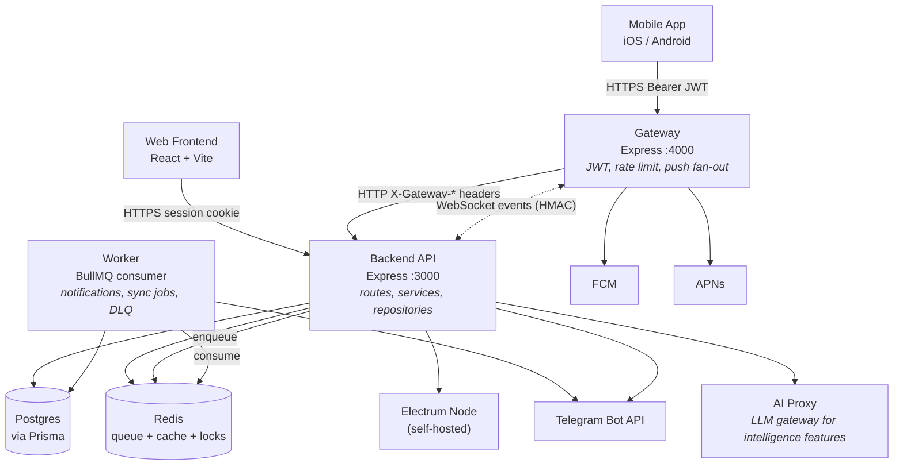

# Container Diagram

Top-level processes and persistent stores inside Sanctuary. Click any container box to jump to its source entry point or per-service architecture doc.

---

## Notable boundaries

| Edge | Auth | Notes |
|---|---|---|
| Mobile → Gateway | JWT Bearer (`sanctuary:access`) | Verified locally with shared `JWT_SECRET`; never reaches backend if invalid |
| Web → Backend | Session cookie | Bypasses gateway entirely |
| Gateway → Backend (HTTP) | HMAC headers (`X-Gateway-Signature`) | For internal endpoints (mobile permission check) |
| Gateway ↔ Backend (WS) | HMAC challenge-response with `GATEWAY_SECRET` | Long-lived; auto-reconnects every 5s |
| Backend → Telegram | Per-user bot token (Telegram API) | **Two distinct call paths exist** — see [`notification-pipeline.md`](notification-pipeline.md) |
| Worker → Redis | Redis password | Worker is the consumer of every BullMQ queue |

The cross-package boundary rules enforced statically by `scripts/check-architecture-boundaries.mjs` correspond to the edges *missing* from this diagram (e.g. browser code may not import server internals; gateway may not import server internals).
