# Frontend module graph

Auto-generated by `npm run arch:graphs`. Do not edit by hand — the architecture CI workflow regenerates this on every PR and fails the build if the committed file is stale.

## How to read this graph

This is an import-dependency appendix for drift detection. It answers "which source groups import which other source groups?" and does not replace the hand-authored C4 diagrams.

- Nodes are collapsed by directory (`--collapse '^[^/]+/[^/]+/'`) so the diagram stays readable.
- Blank nodes inside collapsed groups are files hidden by the collapse rule.
- Use this page to spot unexpected dependency direction, then jump back to the service architecture and source files for design intent.

```mermaid
flowchart LR

0["App.tsx"]
subgraph 1["components"]
2["AILabelSuggestion.tsx"]
subgraph 3["AILabelSuggestion"]
4[" "]
end
5["AIQueryInput.tsx"]
subgraph 6["AIQueryInput"]
7[" "]
end
subgraph 8["AISettings"]
9[" "]
end
subgraph A["Account"]
B[" "]
end
subgraph C["AgentManagement"]
D[" "]
end
subgraph E["AgentWalletDashboard"]
F[" "]
end
G["Amount.tsx"]
H["AnimatedBackground.tsx"]
subgraph I["AnimatedBackground"]
J[" "]
end
subgraph K["AuditLogs"]
L[" "]
end
subgraph M["BackupRestore"]
N[" "]
end
subgraph O["BlockVisualizer"]
P[" "]
end
Q["ChangePasswordModal.tsx"]
subgraph R["ConnectDevice"]
S[" "]
end
subgraph T["ConsoleDrawer"]
U[" "]
end
subgraph V["CreateWallet"]
W[" "]
end
subgraph X["Dashboard"]
Y[" "]
end
subgraph Z["DeviceDetail"]
10[" "]
end
subgraph 11["DeviceList"]
12[" "]
end
subgraph 13["DraftList"]
14[" "]
end
15["ErrorBoundary.tsx"]
subgraph 16["FeatureFlags"]
17[" "]
end
18["FiatDisplay.tsx"]
subgraph 19["ImportWallet"]
1A[" "]
end
subgraph 1B["Intelligence"]
1C[" "]
end
1D["LabelManager.tsx"]
subgraph 1E["LabelManager"]
1F[" "]
end
1G["LabelSelector.tsx"]
subgraph 1H["LabelSelector"]
1I[" "]
end
subgraph 1J["Layout"]
1K[" "]
end
subgraph 1L["Login"]
1M[" "]
end
subgraph 1N["Monitoring"]
1O[" "]
end
subgraph 1P["NetworkConnectionCard"]
1Q[" "]
end
1R["NetworkSyncActions.tsx"]
subgraph 1S["NetworkSyncActions"]
1T[" "]
end
1U["NetworkTabs.tsx"]
subgraph 1V["NodeConfig"]
1W[" "]
end
1X["NotificationBadge.tsx"]
1Y["NotificationPanel.tsx"]
subgraph 1Z["NotificationPanel"]
20[" "]
end
21["NotificationToast.tsx"]
subgraph 22["NotificationToast"]
23[" "]
end
24["PayjoinEducationModal.tsx"]
25["PayjoinSection.tsx"]
26["PendingTransfersPanel.tsx"]
subgraph 27["PendingTransfersPanel"]
28[" "]
end
29["PrivacyBadge.tsx"]
2A["PrivacyDetailPanel.tsx"]
subgraph 2B["Settings"]
2C[" "]
end
2D["SpendPrivacyCard.tsx"]
subgraph 2E["SystemSettings"]
2F[" "]
end
2G["TransactionActions.tsx"]
subgraph 2H["TransactionActions"]
2I[" "]
end
2J["TransactionExportModal.tsx"]
2K["TransactionFlowPreview.tsx"]
2L["TransactionFlowPreviewParts.tsx"]
subgraph 2M["TransactionList"]
2N[" "]
end
2O["TransferOwnershipModal.tsx"]
subgraph 2P["TransferOwnershipModal"]
2Q[" "]
end
subgraph 2R["UTXOList"]
2S[" "]
end
subgraph 2T["UsersGroups"]
2U[" "]
end
2V["Variables.tsx"]
subgraph 2W["Variables"]
2X[" "]
end
subgraph 2Y["WalletDetail"]
2Z[" "]
end
subgraph 30["WalletList"]
31[" "]
end
32["WalletStats.tsx"]
subgraph 33["WalletStats"]
34[" "]
end
35["animatedPatterns.ts"]
subgraph 36["animations"]
37[" "]
end
subgraph 38["cells"]
39[" "]
end
subgraph 3A["columns"]
3B[" "]
end
3C["privacyScoreUtils.ts"]
subgraph 3D["qr"]
3E[" "]
end
subgraph 3F["send"]
3G[" "]
end
subgraph 3H["ui"]
3I[" "]
end
end
subgraph 3J["contexts"]
3K["AppNotificationContext.tsx"]
3L["CurrencyContext.tsx"]
3M["NotificationContext.tsx"]
3N["SidebarContext.tsx"]
3O["UserContext.tsx"]
subgraph 3P["send"]
3Q[" "]
end
end
subgraph 3R["hooks"]
subgraph 3S["qr"]
3T[" "]
end
subgraph 3U["queries"]
3V[" "]
end
subgraph 3W["send"]
3X[" "]
end
3Y["soundPresets.ts"]
subgraph 3Z["soundPresets"]
40[" "]
end
41["useAIStatus.ts"]
42["useAppCapabilities.ts"]
43["useAppShortcuts.ts"]
44["useCopyToClipboard.ts"]
45["useDelayedRender.ts"]
46["useDeviceConnection.ts"]
47["useDeviceModels.ts"]
48["useDeviceSave.ts"]
49["useErrorHandler.ts"]
4A["useHardwareWallet.ts"]
4B["useIntelligenceStatus.ts"]
4C["useLoadingState.ts"]
4D["useModalForm.ts"]
4E["useNotificationSound.ts"]
4F["useNotify.ts"]
4G["usePaginatedList.ts"]
4H["useUserPreference.ts"]
subgraph 4I["websocket"]
4J[" "]
end
end
subgraph 4K["services"]
4L["bbqr.ts"]
subgraph 4M["deviceParsers"]
4N[" "]
end
subgraph 4O["hardwareWallet"]
4P[" "]
end
4Q["websocket.ts"]
end
subgraph 4R["shared"]
subgraph 4S["constants"]
4T[" "]
end
subgraph 4U["schemas"]
4V[" "]
end
subgraph 4W["types"]
4X[" "]
end
subgraph 4Y["utils"]
4Z[" "]
end
end
subgraph 50["src"]
subgraph 51["api"]
52[" "]
end
subgraph 53["app"]
54[" "]
end
subgraph 55["types"]
56[" "]
end
end
subgraph 57["themes"]
58["backgroundCategories.ts"]
subgraph 59["bamboo"]
5A[" "]
end
subgraph 5B["copper"]
5C[" "]
end
subgraph 5D["cyber"]
5E[" "]
end
subgraph 5F["desert"]
5G[" "]
end
subgraph 5H["forest"]
5I[" "]
end
5J["index.ts"]
subgraph 5K["midnight"]
5L[" "]
end
subgraph 5M["ocean"]
5N[" "]
end
5O["patterns.ts"]
5P["registry.ts"]
subgraph 5Q["sakura-sumie"]
5R[" "]
end
subgraph 5S["sakura-yoshino"]
5T[" "]
end
subgraph 5U["sanctuary"]
5V[" "]
end
subgraph 5W["seasonal"]
5X[" "]
end
subgraph 5Y["serenity"]
5Z[" "]
end
subgraph 60["sunrise"]
61[" "]
end
subgraph 62["sunset"]
63[" "]
end
64["types.ts"]
end
subgraph 65["utils"]
66["bip21Parser.ts"]
67["bufferUtils.ts"]
68["clipboard.ts"]
69["deviceConnection.ts"]
6A["download.ts"]
6B["errorHandler.ts"]
6C["explorer.ts"]
6D["formatters.ts"]
6E["logger.ts"]
6F["nodeGlobals.ts"]
6G["transaction.ts"]
6H["urDeviceDecoder.ts"]
6I["urPsbt.ts"]
6J["utxoAge.ts"]
6K["validateAddress.ts"]
end
0-->54
2-->4
4-->52
4-->6E
5-->7
7-->52
7-->6E
9-->52
9-->6E
9-->41
9-->6B
9-->4J
B-->3O
B-->3I
B-->52
B-->6E
B-->68
D-->52
D-->6B
D-->3I
F-->3I
F-->6B
F-->6E
F-->52
G-->3L
H-->5O
H-->J
L-->4C
L-->52
L-->6E
N-->3I
N-->52
N-->6E
N-->3K
N-->6A
Q-->52
Q-->6E
Q-->3I
S-->3I
S-->69
S-->3T
S-->46
S-->47
S-->48
S-->4P
S-->4N
U-->52
W-->3I
W-->3V
W-->49
W-->52
W-->6B
W-->6E
Y-->1U
Y-->3I
Y-->3L
Y-->3M
Y-->3V
Y-->45
Y-->4E
Y-->4J
Y-->52
Y-->6E
Y-->4Z
Y-->P
Y-->G
Y-->2N
10-->3I
10-->4P
10-->3E
10-->4N
10-->52
10-->6E
10-->6H
10-->26
10-->2O
10-->3O
12-->3I
12-->3B
12-->39
12-->3O
12-->4C
12-->52
12-->6B
12-->6E
14-->G
14-->18
14-->2K
14-->6D
14-->3L
14-->4C
14-->52
14-->6A
14-->6E
17-->4C
17-->52
17-->3I
18-->3L
1A-->3V
1A-->3I
1A-->52
1A-->4P
1A-->6E
1A-->3E
1C-->3V
1C-->3I
1C-->52
1C-->6E
1C-->L
1D-->1F
1F-->3V
1F-->4Z
1F-->6E
1G-->1I
1I-->3V
1I-->6E
1K-->U
1K-->3I
1K-->54
1K-->1X
1K-->1Y
1K-->52
1K-->6E
1K-->3K
1K-->3O
1K-->3V
1K-->42
1K-->43
1K-->6B
1M-->H
1M-->3I
1M-->3O
1M-->52
1O-->3I
1O-->4C
1O-->52
1Q-->52
1Q-->6B
1Q-->6E
1Q-->3I
1R-->1T
1T-->52
1T-->6B
1W-->3I
1W-->1Q
1W-->52
1W-->6B
1W-->6E
1Y-->3K
1Y-->20
20-->3K
20-->6E
21-->23
25-->52
25-->24
26-->28
28-->3I
28-->3O
28-->4C
28-->52
29-->3C
2A-->3L
2A-->3C
2C-->3L
2C-->3O
2C-->4E
2C-->3I
2C-->52
2C-->6B
2C-->6E
2C-->5J
2C-->58
2D-->3C
2F-->4C
2F-->52
2F-->3I
2G-->2I
2I-->3I
2I-->52
2I-->6E
2J-->52
2J-->6E
2J-->3I
2K-->3L
2K-->2L
2L-->6D
2N-->6C
2N-->6G
2N-->2G
2N-->2K
2N-->52
2N-->6E
2N-->2
2N-->3L
2N-->41
2N-->G
2N-->1G
2O-->2Q
2Q-->3I
2Q-->52
2Q-->6E
2S-->6J
2S-->3L
2S-->3V
2S-->52
2S-->6E
2S-->3I
2S-->6C
2S-->G
2S-->29
2S-->2A
2U-->3I
2U-->49
2U-->4C
2U-->52
2U-->6E
2V-->2X
2X-->4C
2X-->52
2Z-->52
2Z-->6G
2Z-->6B
2Z-->6E
2Z-->3K
2Z-->49
2Z-->4G
2Z-->3M
2Z-->4J
2Z-->4Z
2Z-->44
2Z-->3I
2Z-->25
2Z-->26
2Z-->3L
2Z-->6C
2Z-->6D
2Z-->1G
2Z-->14
2Z-->3O
2Z-->1D
2Z-->32
2Z-->3V
2Z-->2N
2Z-->5
2Z-->2S
2Z-->41
2Z-->2J
2Z-->2O
2Z-->G
31-->3V
31-->45
31-->G
31-->3L
31-->3I
31-->39
31-->3O
31-->3B
31-->1U
31-->1R
32-->3L
32-->45
32-->34
35-->5O
39-->12
39-->3I
3E-->6E
3E-->6I
3G-->P
3G-->18
3G-->3I
3G-->3O
3G-->49
3G-->4C
3G-->6E
3G-->52
3G-->3Q
3G-->3X
3G-->4A
3G-->3L
3G-->66
3G-->6K
3G-->6J
3G-->29
3G-->2D
3G-->3E
3G-->2K
3I-->4H
3K-->6E
3L-->52
3L-->6E
3L-->3O
3L-->4Z
3M-->21
3O-->52
3O-->5J
3O-->6E
3T-->4L
3T-->4N
3T-->69
3T-->6E
3T-->6H
3V-->52
3X-->52
3X-->6E
3X-->3L
3X-->67
3X-->49
3X-->4E
3X-->4Z
3X-->6A
3X-->4A
3Y-->40
41-->52
42-->4B
43-->54
44-->68
46-->4P
46-->69
46-->6E
47-->52
47-->6E
48-->3N
48-->52
48-->6E
49-->52
49-->4F
4A-->4P
4A-->6E
4B-->52
4C-->4Z
4D-->6B
4E-->3O
4E-->6E
4E-->3Y
4F-->3K
4F-->3M
4H-->3O
4H-->6E
4J-->4Q
4J-->52
4J-->6E
4L-->6E
4N-->4Z
4N-->6E
4P-->6E
4P-->4Z
4P-->67
4P-->52
4Q-->6E
4Z-->4T
52-->6E
52-->6A
54-->1M
54-->Q
54-->1K
54-->21
54-->B
54-->D
54-->F
54-->9
54-->L
54-->N
54-->S
54-->W
54-->Y
54-->10
54-->12
54-->15
54-->17
54-->1A
54-->1C
54-->1O
54-->1W
54-->3G
54-->2C
54-->2F
54-->3I
54-->2U
54-->2V
54-->2Z
54-->31
54-->H
54-->3M
54-->3O
54-->4J
54-->6E
54-->52
54-->5O
58-->5O
5J-->6E
5J-->5A
5J-->5C
5J-->5E
5J-->5G
5J-->5I
5J-->5L
5J-->5N
5J-->5O
5J-->5P
5J-->5R
5J-->5T
5J-->5V
5J-->5X
5J-->5Z
5J-->61
5J-->63
5P-->6E
5P-->5X
68-->6E
69-->4Z
6B-->52
6B-->4Z
6E-->4X
6H-->4N
6H-->6E
6I-->6E
6I-->6H
6K-->4Z
```

