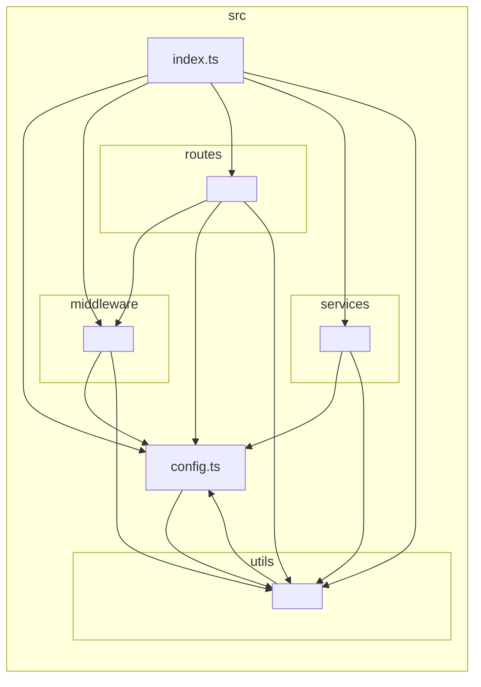

# Gateway module graph

Auto-generated by `npm run arch:graphs`. Do not edit by hand — the architecture CI workflow regenerates this on every PR and fails the build if the committed file is stale.

Nodes are collapsed by directory (`--collapse '^src/[^/]+/'`) so the diagram stays readable.

