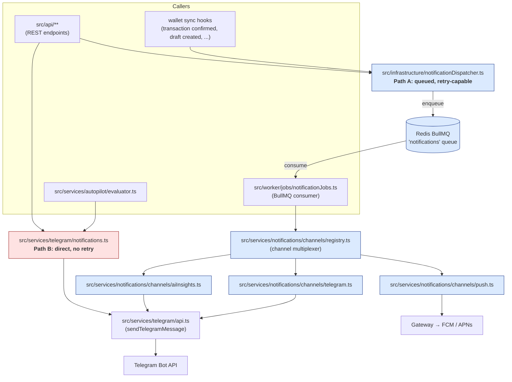

# Notification Pipeline (Component View)

This is the area where the **Telegram dual-path bug** was discovered: the same logical event was reaching Telegram via two divergent code paths depending on the entry point. Documenting this as a Component diagram makes new entry points visible in PR review.

---

## Two delivery paths

---

## Why two paths exist

| Path | Origin | Properties |
|---|---|---|
| **A — Dispatcher → Queue → Worker → Channel registry** | Newer | Persisted in Redis; 5 retry attempts with exponential backoff; survives restarts; uniform across channels (Telegram, push, AI insights) |
| **B — Direct `services/telegram/notifications.ts`** | Older | Synchronous; no retry; no DLQ; bypasses channel registry entirely |

Both call into `services/telegram/api.ts → sendTelegramMessage`, so the Telegram API itself is reached the same way — but everything *upstream* (delivery guarantees, observability, gating) is different.

## Convergence plan

The intent is for **Path B to be removed**. Every direct caller of `services/telegram/notifications` should be migrated to enqueue through `notificationDispatcher`, then the direct module deleted. This diagram exists so that:

1. New entry points are added to the diagram in the same PR — making divergence visible.
2. PRs that introduce a new caller of `services/telegram/notifications` are flagged for architectural review (the box is colored red on this diagram for a reason).
3. When the migration is complete, the red subgraph and this whole "Convergence plan" section get deleted.

## Update checklist for this diagram

- [ ] Adding a new caller of `notificationDispatcher`? Add a node in the `Callers` subgraph.
- [ ] Adding a new channel? Add it under the registry, with its target external system.
- [ ] Adding a *new* direct call to `services/telegram/api.ts` outside the channel registry? Stop. Either route via the dispatcher, or update this diagram with justification and an ADR.
