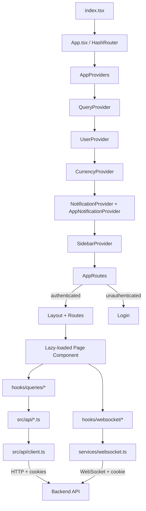
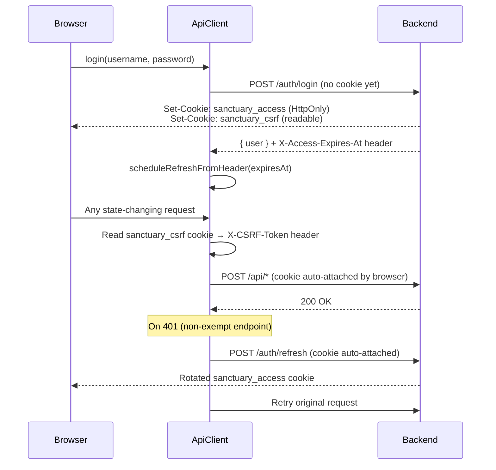

# Frontend Architecture

This document describes the architecture of the Sanctuary React/Vite single-page application and its packaging as an Umbrel app.

## Purpose

`sanctuary/` is the Umbrel app package — it contains `umbrel-app.yml`, `docker-compose.yml`, and `images/` for Umbrel marketplace integration. The actual frontend source lives at the monorepo root alongside the server and gateway packages. There is no `src/` subdirectory inside `sanctuary/`; components, hooks, and contexts live directly at root level (`components/`, `contexts/`, `hooks/`, `providers/`, `services/`, `themes/`), with framework and API wiring in `src/`.

The SPA communicates with the backend server over HTTP and WebSocket. It is a watch-only Bitcoin wallet coordinator: private keys never leave hardware wallets; the frontend only builds and exports PSBTs.

---

## Layer Architecture

| Layer | Location | Responsibility |
|-------|----------|----------------|
| Entry | `index.tsx`, `App.tsx` | Theme init, router, provider composition |
| Route definitions | `src/app/appRoutes.tsx` | Lazy-loaded page map, nav metadata, capability guards |
| Provider tree | `providers/AppProviders.tsx` | Ordered context composition |
| Pages / components | `components/` | Feature UI; each feature in its own subdirectory |
| Data hooks | `hooks/queries/` | React Query wrappers for server data |
| WebSocket hooks | `hooks/websocket/` | Real-time event subscriptions |
| API module | `src/api/` | Per-resource typed fetch wrappers |
| API client | `src/api/client.ts` | Base fetch: auth, CSRF, retry, timeout |
| Auth policy | `src/api/authPolicy.ts` | Cookie/CSRF rules, 401-refresh decisions |
| WebSocket service | `services/websocket.ts` | Singleton `WebSocketClient`, reconnect, subscriptions |
| Theme system | `themes/` | Registry, 14 themes, CSS variable injection |
| Shared types | `types/`, `shared/` | Domain types shared with server |

---

## Data Flow



---

## Build System

**Vite** (`vite.config.ts`) builds the SPA with:

- `@vitejs/plugin-react` — JSX transform
- `vite-plugin-node-polyfills` (custom variant in `vite.nodePolyfills.ts`) — polyfills `process`, `stream`, `util`, and `Buffer` for hardware-wallet SDKs that assume a Node environment
- Path alias `@` → monorepo root, `@shared` → `shared/`
- Conservative manual chunk splitting: only `vendor-react` (React + ReactDOM + react-router-dom) and `vendor-query` (@tanstack/react-query) are split. `lucide-react`, `recharts`, and hardware-wallet SDKs (`@ngraveio/bc-ur`, `@keystonehq/*`) are intentionally left in the main bundle due to barrel-export, circular-dependency, and WASM initialization constraints documented in `vite.config.ts`.
- `chunkSizeWarningLimit: 5500` — suppressed; splitting was attempted and reverted (commit `0ff0bc0`)

**TypeScript** — project references via `tsconfig.app.json`, `tsconfig.tests.json`, `tsconfig.scripts.json`.

**Tailwind CSS** — configured inline in `index.html` via the CDN script tag; palette tokens map to CSS custom properties (see Theme System below).

---

## Routing

All routes are defined in `src/app/appRoutes.tsx` as `AppRouteDefinition` objects. Every page component is `React.lazy()`-loaded and wrapped in `<ErrorBoundary>` + `<Suspense>` with a typed skeleton fallback. Navigation is `HashRouter`-based (works behind Umbrel's reverse proxy without server-side routing).

Route sections used by the sidebar:

| Section | Routes |
|---------|--------|
| `primary` | Dashboard, Intelligence |
| `wallets` | Wallets, Wallet Detail, Create/Import, Send |
| `hardware` | Devices, Connect Device, Device Detail |
| `system` | Account, Settings |
| `admin` | Node Config, System Settings, Variables, Users & Groups, Backup & Restore, Audit Logs, AI Settings, Monitoring, Feature Flags |

Capability guards (`AppCapability` in `src/app/capabilities.ts`) gate nav items — currently only `intelligence` exists.

---

## Provider Tree

Provider order is load-bearing. See `providers/AppProviders.tsx`:

```
QueryProvider          → React Query cache (singleton QueryClient)
  UserProvider         → Auth state, theme application, 2FA flow
    CurrencyProvider   → BTC price, fiat formatting (depends on user locale)
      NotificationProvider      → Toast queue
        AppNotificationProvider → Badge / alert counts
          SidebarProvider       → Sidebar refresh triggers
```

---

## State Management

Global state uses React Context only — no Redux or Zustand. Server state is managed exclusively by **React Query** (`@tanstack/react-query`):

- `staleTime: 30s`, `gcTime: 5min`, no automatic refetch on focus/reconnect
- Cache is invalidated by WebSocket events via `useWebSocketQueryInvalidation` (mounted in `App.tsx`)
- Query key factories live in `hooks/queries/factory.ts`

Context responsibilities:

| Context | File | State |
|---------|------|-------|
| `UserContext` | `contexts/UserContext.tsx` | Auth user, 2FA pending, login/logout |
| `CurrencyContext` | `contexts/CurrencyContext.tsx` | BTC price, currency formatting |
| `NotificationContext` | `contexts/NotificationContext.tsx` | Toast notifications |
| `AppNotificationContext` | `contexts/AppNotificationContext.tsx` | Badge alerts |
| `SidebarContext` | `contexts/SidebarContext.tsx` | Sidebar refresh triggers |

---

## API Integration

### Client (`src/api/client.ts`)

The base HTTP client wraps `fetch` with:

- `credentials: 'include'` on every request (browser attaches `sanctuary_access` HttpOnly cookie automatically)
- CSRF double-submit: reads `sanctuary_csrf` (non-HttpOnly) and echoes it as `X-CSRF-Token` on POST/PUT/PATCH/DELETE
- `X-Access-Expires-At` response header forwarded to `src/api/refresh.ts` to schedule the next proactive token refresh
- 401 → one refresh-and-retry (via `authPolicy.ts`); credential endpoints (`/auth/login`, `/auth/register`, `/auth/2fa/verify`, `/auth/refresh`) are exempt
- Exponential backoff retry with ±20% jitter for network errors and 5xx responses (default: 3 retries, 1s initial, 10s max)
- 30s default timeout, 120s for file transfers

### Per-resource API modules (`src/api/`)

| Module | Backend route group |
|--------|---------------------|
| `auth.ts` | `/auth/*` |
| `wallets.ts` | `/wallets/*` |
| `transactions/` | `/transactions/*` |
| `devices.ts` | `/devices/*` |
| `drafts.ts` | `/drafts/*` |
| `labels.ts` | `/labels/*` |
| `intelligence.ts` | `/intelligence/*` |
| `sync.ts` | `/sync/*` |
| `bitcoin.ts` | `/bitcoin/*` |
| `price.ts` | `/price/*` |
| `transfers.ts` | `/transfers/*` |
| `payjoin.ts` | `/payjoin/*` |
| `twoFactor.ts` | `/auth/2fa/*` |
| `admin/` | `/admin/*` |

---

## Auth Flow

See `docs/adr/0001-browser-auth-token-storage.md` and `docs/adr/0002-frontend-refresh-flow.md` for the full decision record.



Key points:
- The access token is **never in JavaScript memory or storage** — it lives in an HttpOnly cookie
- `UserContext` determines "am I authenticated?" by calling `GET /auth/me` on mount and interpreting the response (200 = hydrate user, 401 after one refresh attempt = show login)
- WebSocket upgrades carry the HttpOnly cookie automatically on same-origin connections; no auth message is sent — the server authenticates on the HTTP upgrade handshake
- Cross-tab logout is coordinated via `BroadcastChannel` in `src/api/refresh.ts`; `UserContext` subscribes via `onTerminalLogout()`

---

## WebSocket

`services/websocket.ts` is a singleton `WebSocketClient` that manages connection lifecycle. Components subscribe via hooks in `hooks/websocket/`:

| Hook | Purpose |
|------|---------|
| `useWebSocket` | Connection state and channel subscribe/unsubscribe |
| `useWebSocketEvent` | Subscribe to a typed event type |
| `useWalletEvents` | Subscribe to transaction/balance/sync events for a wallet |
| `useWalletLogs` | Stream wallet sync log entries |
| `useModelDownloadProgress` | AI model download progress events |
| `useWebSocketQueryInvalidation` | Invalidate React Query cache on blockchain events |

The client gates all outbound messages on a `isServerReady` flag set only after the server's `connected` welcome message arrives. This prevents race conditions where messages sent between `OPEN` and server-auth-completion are dropped.

---

## Theme System

All five semantically-inverted palettes (`primary`, `warning`, `success`, `sent`, `shared`) expose CSS custom properties via the theme registry. Tailwind reads these CSS variables, not hardcoded hex values.

**Critical: dark mode color scale is inverted for these palettes.**

In dark mode, low shade numbers are dark and high shade numbers are light — the opposite of standard Tailwind:

| Shade | Light mode | Dark mode |
|-------|-----------|-----------|
| 50–200 | Light (backgrounds) | **Dark** (backgrounds) |
| 800–950 | Dark (text) | **Light** (text) |

```tsx
// CORRECT
className="bg-primary-600 text-white dark:bg-primary-100 dark:text-primary-700"

// WRONG — dark:bg-primary-950 renders white in dark mode
className="bg-primary-600 text-white dark:bg-primary-950 dark:text-primary-200"
```

**Not inverted (standard Tailwind behavior):** `sanctuary-*`, `emerald-*`, `rose-*`, `mainnet-*`, `testnet-*`.

The `sanctuary-*` palette maps to `--color-bg-*` CSS variables — it is the structural palette used for backgrounds, borders, and neutral text, and it follows normal Tailwind direction.

`text-[9px]`, `text-[10px]`, `text-[11px]` are intentional compact UI sizes. Do not replace them with named Tailwind classes.

### Theme Registry

`themes/registry.ts` exports `themeRegistry` which manages 14 themes (Sanctuary, Serenity, Forest, Cyber, Sunrise, Ocean, and others). On login, `UserContext` calls `themeRegistry.applyTheme(theme, mode, contrastLevel)` which injects CSS variables into `:root`. Adding a new theme: create `themes/<name>/index.ts` exporting a `ThemeDefinition` and register it in `themes/index.ts`.

---

## File Organization

```
(monorepo root)
├── index.html              # Tailwind CDN config + palette token definitions
├── index.tsx               # Entry point: theme init → ReactDOM.createRoot
├── App.tsx                 # HashRouter, AppProviders, AppRoutes, auth gate
├── App.tsx
├── src/
│   ├── api/                # API client + per-resource fetch modules
│   │   ├── client.ts       # Base client (auth, CSRF, retry)
│   │   ├── authPolicy.ts   # CSRF/refresh policy (no side effects)
│   │   ├── refresh.ts      # Proactive token refresh scheduler
│   │   └── *.ts            # Per-resource modules
│   ├── app/
│   │   ├── appRoutes.tsx   # Route + nav definitions
│   │   ├── capabilities.ts # Feature flag types
│   │   └── browserNavigation.ts
│   └── types/              # API response types
├── components/             # Feature UI components (one subdirectory per feature)
├── contexts/               # React context providers
├── hooks/
│   ├── queries/            # React Query data hooks
│   └── websocket/          # WebSocket event hooks
├── providers/
│   ├── AppProviders.tsx    # Provider composition tree
│   └── QueryProvider.tsx   # React Query client
├── services/
│   └── websocket.ts        # WebSocketClient singleton
├── themes/                 # Theme registry + 14 theme definitions
├── types/                  # Shared domain types
├── utils/                  # logger, errors, safeJson, download helpers
└── sanctuary/              # Umbrel app package
    ├── umbrel-app.yml
    ├── docker-compose.yml
    └── images/
```
