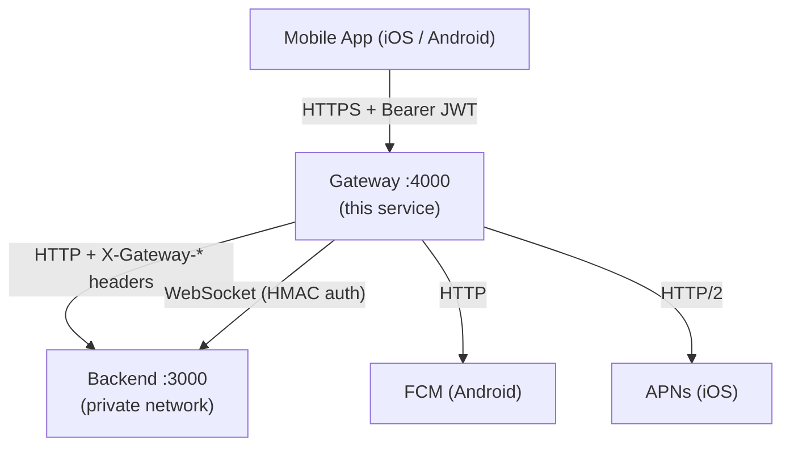
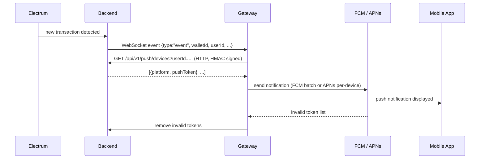

# Gateway Architecture

The gateway is the public-facing API proxy for Sanctuary's mobile clients. It sits between the internet and the private backend server, handling JWT authentication, per-operation rate limiting, Zod request validation, route whitelisting, and push notification delivery. The backend server is never exposed directly.

---

## System Context

---

## Middleware Stack

Every request passes through the following layers in order. Layers earlier in the stack can short-circuit and return an error response without reaching later layers.

| Layer | File | What It Does |
|---|---|---|
| `helmet` | `index.ts` | Sets secure HTTP response headers |
| `cors` | `index.ts` | Enforces `CORS_ALLOWED_ORIGINS` allowlist; allows requests with no `Origin` (native mobile apps) |
| `express.json` | `index.ts` | Parses JSON bodies up to 1 MB |
| `requestLogger` | `middleware/requestLogger.ts` | Structured request/response logging and security event emission |
| Trailing-slash normalization | `index.ts` | Strips trailing slashes before routing |
| `authRateLimiter` | `middleware/rateLimit/limiters.ts` | Applied to the entire `/api/v1/auth` prefix before routing (15 attempts / 15 min, keyed by IP, exponential backoff) |
| `authenticate` | `middleware/auth.ts` | Verifies `Authorization: Bearer <jwt>` against `JWT_SECRET`; rejects expired tokens and 2FA-pending tokens; attaches `req.user` |
| Operation rate limiter | `middleware/rateLimit/limiters.ts` | Operation-specific limits (see table below) |
| `checkWhitelist` | `routes/proxy/whitelist.ts` | Blocks any route not in `GATEWAY_ROUTE_CONTRACTS`; logs blocked attempts as security events |
| `requireMobilePermission` | `middleware/mobilePermission.ts` | For write operations: calls backend `/internal/mobile-permissions/check` via HMAC-signed request; fails closed |
| `validateRequest` | `middleware/validateRequest.ts` | Validates request body against Zod schemas from `shared/schemas/mobileApiRequests`; passes through if no schema is registered |
| `proxy` | `routes/proxy/proxyConfig.ts` | Forwards request to backend via `http-proxy-middleware`; injects `X-Gateway-Request`, `X-Gateway-User-Id`, `X-Gateway-Username` headers |

### Rate Limit Tiers

| Limiter | Window | Limit | Key | Backoff |
|---|---|---|---|---|
| `authRateLimiter` | 15 min | 15 | IP | Exponential (60 s → max 3600 s) |
| `defaultRateLimiter` | 1 min | 60 | User ID (or IP) | Exponential |
| `transactionCreateRateLimiter` | 1 min | 10 | User ID | Fixed 60 s |
| `broadcastRateLimiter` | 1 min | 5 | User ID | Fixed 60 s |
| `addressGenerationRateLimiter` | 1 min | 20 | User ID | Fixed 60 s |
| `deviceRegistrationRateLimiter` | 1 hour | 3 | User ID | Fixed 3600 s |
| `strictRateLimiter` | 1 hour | 10 | User ID | Fixed 3600 s |

---

## Authentication Model

### Mobile clients — JWT Bearer

Mobile apps authenticate with `Authorization: Bearer <access_token>`. The gateway verifies the token locally using the shared `JWT_SECRET`. No backend call is required for verification.

Token requirements enforced at the gateway:
- Audience claim must be `sanctuary:access`
- Token must not be expired
- `pending2FA` claim must not be true (2FA tokens cannot bypass the gate)

The browser-based web UI authenticates via session cookies — those requests go directly to the backend and never pass through the gateway.

### Gateway-to-backend — HMAC

Internal calls from the gateway to the backend (mobile permission checks, WebSocket connection) are authenticated with HMAC-SHA256 using `GATEWAY_SECRET`. This avoids sharing the `JWT_SECRET` for service-to-service communication.

For the backend events WebSocket: the backend sends a challenge on connect; the gateway responds with `HMAC-SHA256(challenge, GATEWAY_SECRET)`. The backend verifies the response before emitting events.

For HTTP permission checks: the gateway signs `POST /internal/mobile-permissions/check` with `X-Gateway-Signature` and `X-Gateway-Timestamp` headers.

---

## Route Whitelist

`GATEWAY_ROUTE_CONTRACTS` in `routes/proxy/whitelist.ts` is the single authoritative list of routes mobile clients can reach. Each entry is a `{ method, pattern (RegExp), openApiPath }` tuple. The proxy, tests, and OpenAPI coverage checks all derive from this same array.

Routes deliberately excluded from the whitelist: admin endpoints, user deletion, node configuration, backup/restore, and all `/internal/*` endpoints.

To expose a new endpoint to mobile apps, add an entry to `GATEWAY_ROUTE_CONTRACTS`. The pattern uses `uuidPattern` and `txidPattern` constants to match path parameters consistently.

---

## Push Notification Pipeline

The gateway maintains a persistent WebSocket connection to the backend to receive transaction events. The backend never calls push providers directly.

FCM (Android) and APNs (iOS) are initialized at startup only when credentials are configured. If neither is configured the gateway logs a warning and continues operating without push support.

Invalid tokens returned by FCM or APNs are propagated back to the backend so stale device registrations are pruned automatically.

---

## TLS

The gateway terminates TLS directly — no nginx or reverse proxy is required in front of it. When `TLS_ENABLED=true`, it creates an `https.Server` using certificates at `TLS_CERT_PATH` / `TLS_KEY_PATH`. The cipher suite is restricted to ECDHE + AES-GCM / ChaCha20-Poly1305 with `honorCipherOrder: true`. Minimum version defaults to TLSv1.2.

---

## Configuration

| Variable | Required | Default | Description |
|---|---|---|---|
| `JWT_SECRET` | Yes | — | Must match backend; used for local JWT verification |
| `GATEWAY_SECRET` | Yes* | — | Shared HMAC secret for gateway↔backend auth; warn if absent |
| `GATEWAY_PORT` | No | `4000` | Listening port |
| `BACKEND_URL` | No | `http://backend:3000` | Backend HTTP base URL |
| `BACKEND_WS_URL` | No | `ws://backend:3000` | Backend WebSocket base URL |
| `TLS_ENABLED` | No | `false` | Enable HTTPS (`true` to activate) |
| `TLS_CERT_PATH` | If TLS | `/app/config/ssl/fullchain.pem` | Certificate chain path |
| `TLS_KEY_PATH` | If TLS | `/app/config/ssl/privkey.pem` | Private key path |
| `TLS_CA_PATH` | No | — | Optional intermediate CA chain |
| `TLS_MIN_VERSION` | No | `TLSv1.2` | `TLSv1.2` or `TLSv1.3` |
| `RATE_LIMIT_WINDOW_MS` | No | `60000` | Default rate limit window (ms) |
| `RATE_LIMIT_MAX` | No | `60` | Max requests per default window |
| `CORS_ALLOWED_ORIGINS` | No | — | Comma-separated browser origin allowlist; empty still allows native/no-origin requests plus loopback development origins |
| `FCM_PROJECT_ID` | No | — | Firebase project ID (Android push) |
| `FCM_PRIVATE_KEY` | No | — | Firebase service account private key |
| `FCM_CLIENT_EMAIL` | No | — | Firebase service account email |
| `APNS_KEY_ID` | No | — | APNs auth key ID |
| `APNS_TEAM_ID` | No | — | Apple Developer team ID |
| `APNS_PRIVATE_KEY` | No | — | APNs `.p8` key content |
| `APNS_BUNDLE_ID` | No | `com.sanctuary.app` | iOS app bundle identifier |
| `LOG_LEVEL` | No | `info` | Logging verbosity |

*`GATEWAY_SECRET` is required for mobile permission checks and WebSocket auth. Without it, permission checks fail closed (deny all) and the backend events WebSocket cannot connect.

---

## Key Files

| File | Purpose |
|---|---|
| `src/index.ts` | Entry point: Express setup, middleware registration, HTTP/HTTPS server creation, graceful shutdown |
| `src/config.ts` | Typed config object loaded from environment variables; `validateConfig()` exits on missing required vars |
| `src/middleware/auth.ts` | JWT verification; attaches `req.user`; `authenticate` and `optionalAuth` variants |
| `src/middleware/rateLimit/limiters.ts` | All rate limiter instances and their per-tier configuration |
| `src/middleware/rateLimit/backoff.ts` | Exponential backoff tracker keyed by client ID; cleaned up every 5 minutes |
| `src/middleware/mobilePermission.ts` | `requireMobilePermission(action)` factory; HMAC-signs calls to backend; fails closed |
| `src/middleware/validateRequest.ts` | Zod validation against `ROUTE_SCHEMAS`; passes through unregistered routes |
| `src/routes/proxy/whitelist.ts` | `GATEWAY_ROUTE_CONTRACTS` — the authoritative route allowlist and `checkWhitelist` middleware |
| `src/routes/proxy/proxyConfig.ts` | `http-proxy-middleware` instance; injects gateway headers; handles proxy errors |
| `src/routes/proxy/index.ts` | Router wiring: maps routes to their specific rate limiters, permission checks, and the proxy |
| `src/services/backendEvents/index.ts` | WebSocket client to backend; HMAC challenge-response auth; auto-reconnects after 5 s |
| `src/services/push/index.ts` | Unified push API (`sendToDevices`); routes to FCM or APNs by platform; surfaces invalid tokens |
| `src/services/push/fcm.ts` | Firebase Admin SDK integration for Android notifications |
| `src/services/push/apns.ts` | `@parse/node-apn` integration for iOS notifications |
